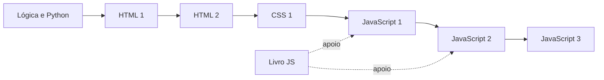

<div align="center">

# 🌱 Desafios PFT

### Miniprojetos do programa Florescendo Talentos

Uma coleção de exercícios práticos para aprender desenvolvimento web e lógica de programação de forma progressiva, didática e conectada.

[](https://github.com/r0b14/Desafios-PFT)
[](https://github.com/r0b14/Desafios-PFT/commits)
[](https://github.com/r0b14/Desafios-PFT)
[](https://github.com/r0b14/Desafios-PFT/issues)


[Sobre](#-sobre-o-repositório) •
[Trilhas](#-trilhas-de-aprendizagem) •
[Projetos](#-projetos-em-destaque) •
[Executar](#-como-executar) •
[Contribuir](#-como-contribuir)

</div>

---

## 🌼 Sobre o repositório

Este repositório reúne desafios, exemplos e miniprojetos desenvolvidos durante as trilhas do **Projeto Florescendo Talentos**.

O conteúdo foi organizado para que cada exercício trabalhe um conjunto pequeno de conceitos. Dessa forma, o aprendizado acontece em etapas: primeiro a lógica, depois a estrutura das páginas, a apresentação visual e, por fim, a interatividade.

> **Objetivo:** transformar conceitos de programação em projetos curtos, compreensíveis e fáceis de consultar novamente.

### Como o conteúdo é apresentado

- 📖 Código comentado e escrito de forma didática.
- 🧩 Um problema bem definido em cada exercício.
- 📈 Evolução gradual entre aulas e módulos.
- 🔗 Relações entre Lógica, HTML, CSS e JavaScript.
- 🖥️ Projetos que podem ser executados no navegador ou no terminal.

---

## 🗺️ Trilhas de aprendizagem

| Trilha | Conteúdo principal | Situação atual |
| --- | --- | :---: |
| [Lógica](./Lógica/) | Algoritmos e fundamentos de programação com Python | ✅ Conteúdo disponível |
| [HTML1](./HTML1/) | Estrutura, semântica, formatação, mídias, SVG, formulários e eventos | ✅ Aulas 01–10 implementadas |
| [HTML2](./HTML2/) | Continuação dos fundamentos e recursos do HTML | 🧱 Estrutura preparada |
| [CSS-1](./CSS-1/) | Cores, fundos, bordas, espaçamentos, Box Model e fontes | 🚧 Aulas 02–06 implementadas |
| [JS-1](./JS-1/) | Variáveis, condicionais, repetições, funções e arrays | ✅ Projetos disponíveis |
| [JS-2](./JS-2/) | DOM, eventos, callbacks, módulos e aplicações interativas | ✅ Projetos disponíveis |
| [JS-3](./JS-3/) | Conteúdos avançados de JavaScript | 🚧 Em evolução |
| [Livro-JS](./Livro-JS/) | Exercícios organizados por capítulos | ✅ Material complementar |
| [docs](./docs/) | Página e documentação do projeto | 🚧 Em evolução |

### Caminho sugerido



---

## ✨ Projetos em destaque

### HTML 1

| Aula | Projeto | Conceitos |
| :---: | --- | --- |
| [01](./HTML1/Aula01/) | Fundamentos do HTML | `html`, `head`, `body`, títulos e parágrafos |
| [02](./HTML1/Aula02/) | Análise de um portal de notícias | Semântica, contraste, alinhamento, repetição e proximidade |
| [03](./HTML1/Aula03/) | Receita de bolo de chocolate | Listas, tabelas, navegação interna e `details` |
| [04](./HTML1/Aula04/) | Receita com texto formatado | Cabeçalhos, parágrafos, `strong`, `b`, `i` e `u` |
| [05](./HTML1/Aula05/) | Currículo digital | Listas ordenadas, listas não ordenadas e tabelas |
| [06](./HTML1/Aula06/) | Página biográfica | Links internos, links externos, `href`, `id` e `target` |
| [07](./HTML1/Aula07/) | Tutorial de bolo com mídias | Imagens, texto alternativo, legendas e vídeo incorporado |
| [08](./HTML1/Aula08/) | Dashboard de pesquisa | SVG, retângulos, coordenadas, cores e gradiente |
| [09](./HTML1/Aula09/) | Cadastro de perfil | Formulários, campos, opções e validação nativa |
| [10](./HTML1/Aula10/) | Mini banco | Formulário, DOM e eventos de envio e mouse |

### CSS 1

| Aula | Projeto | Conceitos |
| :---: | --- | --- |
| [02](./CSS-1/Aula02/) | Página com três receitas | Cores, fundos e bordas |
| [03](./CSS-1/Aula03/) | Caderno de receitas | `margin` e `padding` |
| [04](./CSS-1/Aula04/) | Biografia fictícia | Box Model e `box-sizing` |
| [05](./CSS-1/Aula05/) | Receitas em destaque | `outline` e `outline-offset` |
| [06](./CSS-1/Aula06/) | Receitas com estilo | Propriedades de texto e fontes |

### Lógica e JavaScript

- Os desafios de [Lógica](./Lógica/) trabalham entrada de dados, condicionais, repetições, coleções, funções e arquivos usando Python.
- Os projetos de [JS-1](./JS-1/) transportam esses fundamentos para JavaScript.
- Os exercícios de [JS-2](./JS-2/) avançam para páginas interativas, manipulação do DOM e eventos.

---

## 🧭 Estrutura do projeto

```text
Desafios-PFT/
├── CSS-1/          # Miniprojetos de estilização
├── HTML1/          # Primeira trilha de HTML
├── HTML2/          # Segunda trilha de HTML
├── JS-1/           # Fundamentos de JavaScript
├── JS-2/           # JavaScript e interatividade
├── JS-3/           # JavaScript avançado
├── Livro-JS/       # Exercícios complementares
├── Lógica/         # Lógica de programação com Python
├── docs/           # Página e documentação
└── README.md
```

As pastas de aula normalmente possuem esta estrutura:

```text
AulaXX/
├── index.html
├── style.css
└── script.js
```

Nem todo projeto utiliza os três arquivos. Em exercícios introdutórios, alguns deles são mantidos apenas para preparar a evolução das aulas seguintes.

---

## 🚀 Como executar

### 1. Clone o repositório

```bash
git clone https://github.com/r0b14/Desafios-PFT.git
cd Desafios-PFT
```

### 2. Projetos HTML, CSS e JavaScript para navegador

Abra o arquivo `index.html` da aula desejada diretamente no navegador. Também é possível utilizar uma extensão de servidor local, como o **Live Server** do VS Code.

Exemplo:

```text
HTML1/Aula03/index.html
```

### 3. Exercícios JavaScript no terminal

É necessário ter o [Node.js](https://nodejs.org/) instalado.

```bash
node JS-1/Project3.js
```

### 4. Desafios de lógica em Python

É necessário ter o [Python](https://www.python.org/) instalado.

```bash
python "Lógica/Desafio5.py"
```

> Alguns exercícios utilizam `prompt`, `alert` ou o DOM e, por isso, devem ser executados no navegador em vez do Node.js.

---

## 🧠 Metodologia de estudo

1. Leia o enunciado do desafio.
2. Identifique as entradas, o processamento e a saída esperada.
3. Tente desenvolver uma solução antes de consultar o exemplo.
4. Execute o código e teste situações diferentes.
5. Compare sua solução com o projeto disponível.
6. Registre dúvidas e melhorias para revisar depois.

> **Dica:** o modo de preparo de uma receita é um bom exemplo de algoritmo: existe uma sequência de passos, dados de entrada e um resultado esperado.

---

## 🤝 Como contribuir

Contribuições, correções e novas ideias são bem-vindas.

1. Faça um fork do repositório.
2. Crie uma branch: `git switch -c minha-contribuicao`.
3. Faça as alterações e testes necessários.
4. Crie um commit descritivo.
5. Envie a branch e abra um Pull Request.

Para dúvidas ou sugestões, você também pode [abrir uma issue](https://github.com/r0b14/Desafios-PFT/issues).

---

## 📄 Licença

Este repositório ainda não possui um arquivo de licença. Até que uma licença seja adicionada, consulte o responsável pelo projeto antes de reutilizar o conteúdo fora do contexto de estudo.

---

## 👤 Responsável

<div align="center">

[](https://github.com/r0b14)

**Projeto Florescendo Talentos** — formação, prática e inclusão tecnológica.

_O conhecimento floresce quando é compartilhado._ 🌼

</div>
